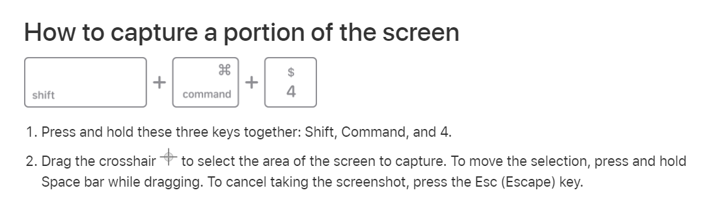

# TeacupImageTranslator

Translates french image to English.

After the mac user takes a screenshot, this program allows them to press "Enter" to translate the screenshot to English

# Installation - MAC OS

Run the following command : `./install_mac.sh`

# Usage - MAC OS

To translate text:

## 0. Open Terminal

## 1. Run `main.py`

## 2. Capture portion of screen 

## 3. Go back to Terminal and press enter

